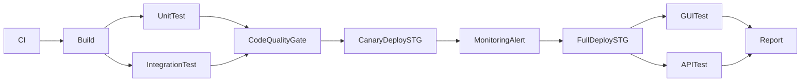
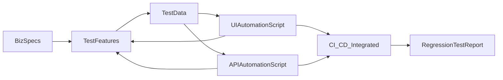
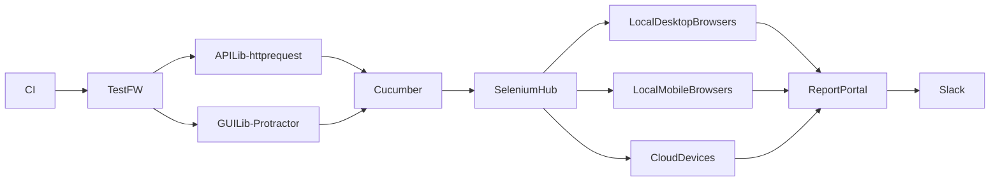

# Test Plan

  

A detail plan for automated testing Travel Insurance application

```

Glossary:

1. SDE : Software Development Engineer

2. SDET : Software Development Engineer in Test

3. QAE: Manual Software Test Engineer

```

  

## Project :

  

#### Automated regression test for Travel Insurance.

  

## Goal

  

- Automated all possible manual regression test cases

- Reduce workload from manual works

- Verify all important business flow before deploying

- Bring confidence for each deployment to production

  

## Assumptions

  

1. All new code have been reviewed by SDEs/SDETs

2. All unit and integration tests are being written, updated and reviewed by the SDEs/SDETs/QAEs

3. There are existing test cases/suites written by QAEs. ( Incase we don't have any existing stuff, manual tests should be written by QAEs/SDETs

## Deliverables

1. Test scripts to automated regression test every deployment

2. Test Report

3. Business Coverage Percent ( estimated )

## Test Approach

1.  ### Test types

-  **API test**

>  - Interact with service layer, send calls to APIs/services then validate output ( http code/ http response/ gRPC response message ) .

>  - Interact with model layer, send queries to database then validate out ( records created / updated/ deleted , records match with response from api/service layer)

- Goals :

- Validate the correctness of all backend functions

-  **GUI test**

>  - Intera ct with browser,simulate end-user behaviors then verify how application works, how front end application responses/displays to user,. any broken elements.

>  - All test cases represent for previous bug, issue which often happen

2.  ### Tools

- API testing:

> There are many options for api testing

1. PostMan

- Pros:

- Can be share between SDEs - SDETs - QAEs

- Have GUI, everyone can you

- Cons:

- Have GUI :D, then sometime it's too complex

2. API testing lib together with GUI test framework

- Pros:

- Both api - gui tests are maintained in same location

- Cons:

- Once number of tests is becoming huge, it's complex for rookies able to understand / maintain

3. API testing lib together with backend repo

- Pros:

- Easy to maintain by both SDEs/SDETs

- Update test when feature changes could be faster

- Cons :

- Multiple languages SDETs have to write

> Overall: Depend on development process

- GUI testing:

- Programming Languages :

- Java : Common language in Vietnam, many supported libs

- Python : Common language, easy to learn ,many supported libs

- NodeJS : Many modern test framework built with this language.

> In here, I choose NodeJS, the reason is easier if GUI test framework - front end framework are same languages. If necessary we can switch FE-SDE/SDETs to develop together

  

- Core API:

- SeleniumJS

- Protractor

- WebdriverIO

All of them are good, I choose Protractor as it has alot of pre-build functions to help my work easier. And its community is huge.

- BDD framework:

- Cucumber: Almost SDETs/QAEs love this.

- Reporter:

- basic HTML report : able to store in local / CI workplace, view by open file

- Report Portal : Central server to store report with ML integrated [More details...](https://reportportal.io/)

I choose report portal to not miss any report, can analyze test report each round.

> Overall: Protractor + Cucumber + Report Portal

  

## Schedule

> Depend on how our CI/CD pipeline work

  

- Idealy, this regression test should run after :

- Code is merged to protect branch

- Deploying to staging / UAT environment

- Unit test passed

- Integration test passed

- Code coverage percent on new code line are passed

  

- For e.g:

  



  

## Facilities

-  ### Must have

- Business Specification document provide

- 1 VM instance to execute test

- Any works from SDEs to make AUT testable

- A clean, as much as posible same as Prodcution environment

-  ### Nice to have

- Test Management server

- 1 VM instance to host report portal

## Process



## Framework Architect


- More details, please check on assignment 2 
## Risks

- AUT is not testable

- In some design, application/function are not able to test. This common software architect bug. Fixing this need to involve more SDEs/Sr.TAs and making test progress would be slower than expect

- Test environment is not good enough

- Test environmnet somehow is not same config with production, then it would not behave correctly and give flaky tests, unexpected result

- Many change requests come during tests are making

- This would slowly/ add more effort for making test scripts.

- Not enough test data preparation

- Happen when SDEs/SDETs don't understand system deeply, includemake lesson learn then

## FAQ

  

- Does making api + gui tests duplicate work?

> No, while api test validate correctness of data, gui test only verify how application work. This reduce many effort in maintaining when frontend - backend changes

- What is system testable ?

> Refer to [Design for Testability ](https://en.wikipedia.org/wiki/Software_testability)

- Can we skip unit test / integration test ?

> No, while unit tests / integration tests are low cost than api/gui tests, there is no reason to put more dependents on them.

  

## Question

  

- What are the most used browsers's application?

- What are screen size most used from this application?

- Do we have Fully and updated Business Specs?